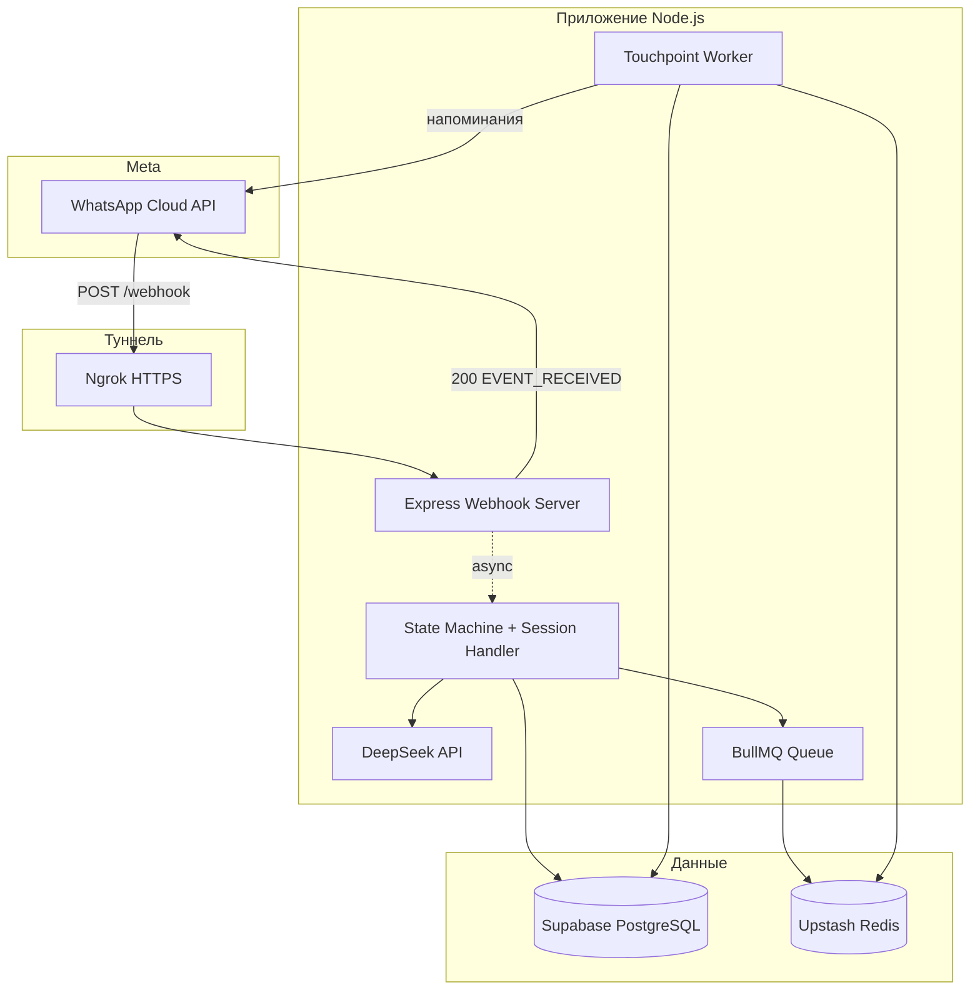

# MediaPeace — WhatsApp AI Lead Qualification Bot

Интеллектуальный чат-бот для WhatsApp Cloud API, который квалифицирует лиды в диалоге: собирает имя, компанию, сферу, услугу и город, сохраняет историю в CRM и автоматически отправляет цепочку напоминаний, если клиент перестал отвечать.

---

## Описание проекта

**MediaPeace WhatsApp Bot** — backend-сервис на Node.js и TypeScript, который:

- принимает входящие сообщения через webhook Meta (WhatsApp Cloud API);
- ведёт пользователя по настраиваемой воронке шагов (state machine);
- использует **DeepSeek API** (OpenAI-совместимый SDK) для распознавания услуги и извлечения кастомных запросов;
- сохраняет лиды и переписку в **Supabase (PostgreSQL)**;
- планирует отложенные напоминания через **BullMQ** и **Upstash Redis**.

Бот рассчитан на production: быстрый ACK webhook, асинхронная обработка, строгая типизация, изоляция секретов в `.env`.

---

## Архитектура системы



### Поток сообщения

1. **Meta WhatsApp Cloud API** отправляет POST на публичный URL (`/webhook`).
2. **Ngrok** пробрасывает HTTPS-трафик на локальный `localhost:3000` (или на сервер в production).
3. **Express** сразу отвечает `200` + `EVENT_RECEIVED` (ACK-only boundary), чтобы Meta не ретраила webhook.
4. **Session Handler** асинхронно обрабатывает текст: Supabase, state machine, DeepSeek, постановка задач в очередь.
5. **BullMQ Worker** (отдельный процесс) по расписанию отправляет touchpoint-сообщения через WhatsApp API.

### Зачем две «базы данных»?

| Хранилище | Роль | Аналогия |
|-----------|------|----------|
| **Supabase (PostgreSQL)** | CRM и долгосрочная память: лиды, статусы, шаги воронки, полная история `messages` | «Журнал и карточка клиента» |
| **Upstash Redis** | Быстрый in-memory брокер для BullMQ: отложенные job'ы, отмена при смене шага, TTL напоминаний | «Секундомер и будильник» |

Supabase не подходит как планировщик с точностью до минуты для тысяч отложенных задач с отменой. Redis + BullMQ дают нативные delayed jobs и идемпотентные `jobId` per `wa_id`. Supabase остаётся источником истины для бизнес-данных.

### AI-слой (DeepSeek)

Клиент OpenAI SDK настроен на `https://api.deepseek.com/v1`. Модель задаётся в `OPENAI_MODEL` (например `deepseek-v4-flash` или fallback `deepseek-chat`). Ответы запрашиваются в формате `json_object` для маппинга услуг и извлечения «Другое».

---

## Логика удержания (Touchpoints)

### ACK-only boundary

```text
Meta POST /webhook  →  Express: res.status(200).send('EVENT_RECEIVED')  →  return
                              ↓ (фон)
                    handleClientMessage(waId, text)
```

Meta ждёт ответ **менее ~20 секунд**. OpenAI/DeepSeek, Supabase и CRM не должны блокировать HTTP-ответ — иначе дублирующие webhook'и и рассинхрон.

### Цепочка BullMQ

При каждом **переходе на новый шаг** воронки:

1. Отменяются все pending job'ы для `wa_id` (`touchpoint_1`, `touchpoint_2`).
2. Ставится `touchpoint_1` с задержкой **2 часа** (в тесте `SHORT_TIMEOUTS=true` → **2 минуты**).
3. Если клиент не ответил — бот шлёт первое напоминание и планирует `touchpoint_2` (+3 часа / +3 мин в тесте).
4. Если снова тишина — статус лида `No Response`, шаг `closed`.

Если клиент пишет снова — `last_client_message_at` обновляется, job'ы пересоздаются; сработавший touchpoint проверяет `scheduledAt` и пропускает отправку.

---

## Структура репозитория

```text
src/
  server.ts              # Express, GET/POST /webhook
  controllers/           # Верификация Meta, ingestion
  bot/                   # State machine, session handler
  services/              # Supabase, DeepSeek, WhatsApp, BullMQ
  workers/               # Touchpoint worker
  config/steps.ts        # Шаги воронки (конфиг без правки движка)
supabase/migrations/     # SQL-схема leads + messages
scripts/                 # PowerShell/CMD для 3 терминалов
```

---

## Инструкция по локальному развёртыванию

### Требования

- Node.js **20+**
- Аккаунты: Meta Developer, Supabase, Upstash, DeepSeek, ngrok
- Три терминала (или Cursor Tasks / `scripts/`)

### 1. Клонирование и зависимости

```bash
git clone https://github.com/IgorMirkhanov/WhatsApp-AI-Bot.git
cd WhatsApp-AI-Bot
npm install
cp .env.example .env
```

### 2. Заполнение `.env`

| Переменная | Где взять |
|------------|-----------|
| `WHATSAPP_ACCESS_TOKEN` | Meta Developer → WhatsApp → API Setup |
| `WHATSAPP_PHONE_NUMBER_ID` | Тот же раздел, ID номера |
| `WHATSAPP_VERIFY_TOKEN` | Произвольная строка (та же в Meta webhook) |
| `SUPABASE_URL` | Supabase → Project Settings → API → URL |
| `SUPABASE_SERVICE_ROLE_KEY` | Supabase → API → `service_role` (секрет, только backend) |
| `OPENAI_API_KEY` | [DeepSeek Platform](https://platform.deepseek.com) → API Keys |
| `OPENAI_MODEL` | `deepseek-v4-flash` или `deepseek-chat` |
| `OPENAI_BASE_URL` | `https://api.deepseek.com/v1` |
| `REDIS_URL` | Upstash → Database → `rediss://...` (TLS) |
| `SHORT_TIMEOUTS` | `true` для теста (2/3 мин), `false` для prod (2/3 ч) |

Выполните SQL из `supabase/migrations/001_initial_schema.sql` в Supabase SQL Editor.

### 3. Ngrok (локально)

```bash
ngrok config add-authtoken <ваш_токен>
ngrok http 3000
```

В Meta укажите: `https://<subdomain>.ngrok-free.app/webhook` и verify token из `.env`.

### 4. Запуск трёх процессов

| # | Команда | Назначение |
|---|---------|------------|
| 1 | `npm run dev` | Webhook + обработка сообщений |
| 2 | `npm run worker` | Touchpoint worker (BullMQ) |
| 3 | `ngrok http 3000` | Публичный HTTPS |

Скрипты Windows: `scripts/start-webhook-server.ps1`, `start-bullmq-worker.ps1`, `start-ngrok-tunnel.ps1`.

### 5. Проверка

- `GET http://localhost:3000/health` → `{"status":"ok"}`
- В логах worker: `Touchpoint worker started` без ошибок Redis
- Тестовое сообщение в WhatsApp → запись в Supabase `leads` / `messages`

---

## Скрипты npm

| Команда | Описание |
|---------|----------|
| `npm run dev` | Сервер с hot-reload (tsx) |
| `npm run worker` | BullMQ worker |
| `npm run build` | Компиляция TypeScript |
| `npm run typecheck` | Проверка типов без emit |

---

## Безопасность

- **Никогда** не коммитьте `.env` — файл в `.gitignore`.
- Используйте `SUPABASE_SERVICE_ROLE_KEY` только на сервере.
- Ротируйте токены Meta / DeepSeek при утечке.
- В production замените ngrok на стабильный домен с TLS.

---

## Лицензия

Проприетарный проект MediaPeace. Использование по согласованию с владельцем репозитория.
