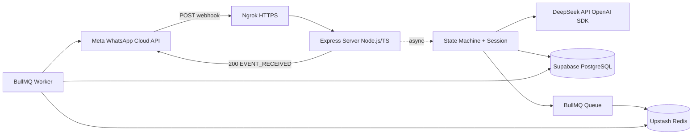

# T3 MediaPeace — WhatsApp AI Lead Qualification Bot

Интеллектуальный WhatsApp-бот для автоматической квалификации лидов с использованием **стейт-машины** и **AI-анализа намерений** (DeepSeek). Собирает контактные и бизнес-данные в диалоге, сохраняет CRM-карточку в Supabase и удерживает клиента цепочкой напоминаний через BullMQ.

---

## Описание проекта

**T3 MediaPeace** — backend на **Node.js** и **TypeScript**, который:

- принимает входящие сообщения от **Meta WhatsApp Cloud API**;
- мгновенно подтверждает webhook (ACK-only), обрабатывает логику асинхронно;
- ведёт пользователя по шагам воронки (`welcome` → имя → компания → сфера → услуга → город → qualified);
- на этапе услуги вызывает **DeepSeek** (`deepseek-v4-flash`) для маппинга ответа в JSON;
- сохраняет лиды и переписку в **Supabase**;
- планирует touchpoint-напоминания в **Upstash Redis** через **BullMQ**.

---

## Архитектура системы



### Компоненты потока

| Компонент | Назначение |
|-----------|------------|
| **Meta WhatsApp Cloud API** | Принимает сообщения пользователя и триггерит HTTP webhook на ваш сервер. |
| **Ngrok** | Безопасный HTTPS-туннель для локальной разработки (`localhost:3000` → публичный URL). |
| **Express Server (Node.js/TS)** | **ACK-only boundary**: сразу отвечает Meta `200` + `EVENT_RECEIVED`, чтобы Meta не дублировала запросы при долгой обработке. |
| **DeepSeek API (OpenAI SDK)** | Модель `deepseek-v4-flash` асинхронно анализирует текст на этапе услуги и возвращает строгий JSON (`json_object`). |
| **Supabase (PostgreSQL)** | Долговременная память: карточки `leads`, шаги воронки, статусы, `messages`, таймстампы. |
| **Upstash Redis & BullMQ** | In-memory «секундомер»: отложенные job'ы напоминаний (touchpoints) без нагрузки на СУБД. |

### Зачем нужны две базы данных?

- **Supabase (диск, CRM)** — надёжное хранилище бизнес-данных: кто клиент, на каком шаге, что ответил, когда последний раз писал. Подходит для отчётов, интеграций и долгой истории.
- **Upstash Redis (оперативная память)** — сверхбыстрые очереди и таймеры BullMQ: «напомнить через 2 мин», отменить job при новом ответе, не создавать тысячи cron-задач в PostgreSQL.

Разделение обязанностей снижает нагрузку на Supabase и даёт предсказуемую работу фоновых таймеров.

---

## Логика удержания (Touchpoints)

1. При **смене шага** воронки отменяются все pending job'ы для `wa_id`.
2. Ставится `touchpoint_1` (в production — через 2 часа; при `SHORT_TIMEOUTS=true` — **через 2 минуты**).
3. Если клиент не ответил — worker отправляет первое напоминание и планирует `touchpoint_2` (+3 мин в тесте / +3 ч в prod).
4. Если снова тишина — статус лида **`No Response`**, сессия закрыта.
5. Любой новый ответ клиента обновляет `last_client_message_at` и сбрасывает цепочку.

Worker запускается отдельно: `npm run worker`.

---

## Инструкция по развёртыванию

### 1. Зависимости

```bash
git clone https://github.com/IgorMirkhanov/WhatsApp-AI-Bot.git
cd WhatsApp-AI-Bot
npm install
cp .env.example .env
```

Выполните `supabase/migrations/001_initial_schema.sql` в Supabase SQL Editor.

### 2. Переменные `.env`

| Переменная | Описание |
|------------|----------|
| `WHATSAPP_ACCESS_TOKEN` | Meta Developer → WhatsApp → API Setup |
| `WHATSAPP_PHONE_NUMBER_ID` | ID телефонного номера в Meta |
| `WHATSAPP_VERIFY_TOKEN` | Строка для верификации GET webhook (та же в Meta Dashboard) |
| `SUPABASE_URL` | Supabase → Project Settings → API |
| `SUPABASE_SERVICE_ROLE_KEY` | Service role key (только backend) |
| `OPENAI_API_KEY` | Ключ DeepSeek Platform |
| `OPENAI_MODEL` | `deepseek-v4-flash` (fallback: `deepseek-chat`) |
| `OPENAI_BASE_URL` | `https://api.deepseek.com/v1` |
| `REDIS_URL` | Upstash → `rediss://...` |
| `SHORT_TIMEOUTS` | `true` — тест 2/3 мин; `false` — prod 2/3 ч |
| `PORT` | `3000` |

> **Важно:** файл `.env` в `.gitignore` и никогда не публикуется в GitHub.

### 3. Три терминала

| # | Команда | Роль |
|---|---------|------|
| 1 | `npm run dev` | Webhook + обработка сообщений |
| 2 | `npm run worker` | Touchpoints (BullMQ) |
| 3 | `ngrok http 3000` | HTTPS для Meta |

Скрипты: `scripts/start-webhook-server.ps1`, `start-bullmq-worker.ps1`, `start-ngrok-tunnel.ps1`.

### 4. Meta Dashboard

- **Callback URL:** `https://<ngrok-host>/webhook`
- **Verify token:** значение `WHATSAPP_VERIFY_TOKEN` из `.env`

### 5. Проверка

```bash
curl http://localhost:3000/health
```

Ожидается: `{"status":"ok",...}`

---

## Структура проекта

```text
src/
  server.ts                 # Express, /webhook
  controllers/              # Meta verify + POST ingestion
  bot/                      # State machine, session handler
  services/                 # Supabase, DeepSeek, WhatsApp, queue
  workers/                  # Touchpoint worker
  config/steps.ts           # Шаги воронки (конфиг)
supabase/migrations/        # SQL schema
```

---

## npm-скрипты

| Команда | Описание |
|---------|----------|
| `npm run dev` | Сервер (tsx watch) |
| `npm run worker` | BullMQ worker |
| `npm run typecheck` | Строгая проверка TypeScript |
| `npm run build` | Сборка в `dist/` |

---

## Безопасность

- Секреты только в `.env` (DeepSeek, Meta, Supabase, Upstash, ngrok).
- `SUPABASE_SERVICE_ROLE_KEY` — только на сервере.
- Ротируйте ключи при утечке; не пересылайте `.env` в мессенджерах.

---

## Репозиторий

https://github.com/IgorMirkhanov/WhatsApp-AI-Bot
